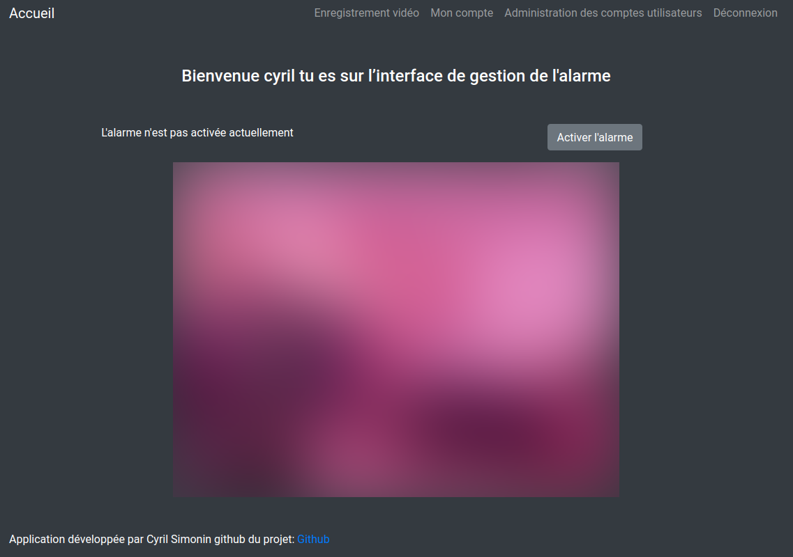

# P13-Raspal-
L'alarme pour raspberry

<h1 align="center"> Raspal </h1>

<h2 align="center">Raspal l'alarme connecté à moins de 50 euros</h2>

## Caractéristiques
RaspAl est un système d’alarme connecter, avec enregistrement vidéo, il fait suite à une demande croissante de sécurité pour les particuliers qui souhaite s’équiper d’alarme pour un prix raisonnable.

Les utilisateurs ont accès au paramètre de l’alarme depuis l’interface web, ils pourront:

Télécharger/visualiser les vidéos déjà enregistrées
Visionner la caméra en direct
Activer et désactiver l’alarme depuis l’interface RaspAl, un email leurs sera envoyer en cas de détéction

## Dépendance

Les dependances nécéssaire à l'application sont disponible dans le fichier **requirement.txt** 

## Installation

L'installation étant assez conséquente un dossier d'exploitation est fournie dans le dossier **Doc**
